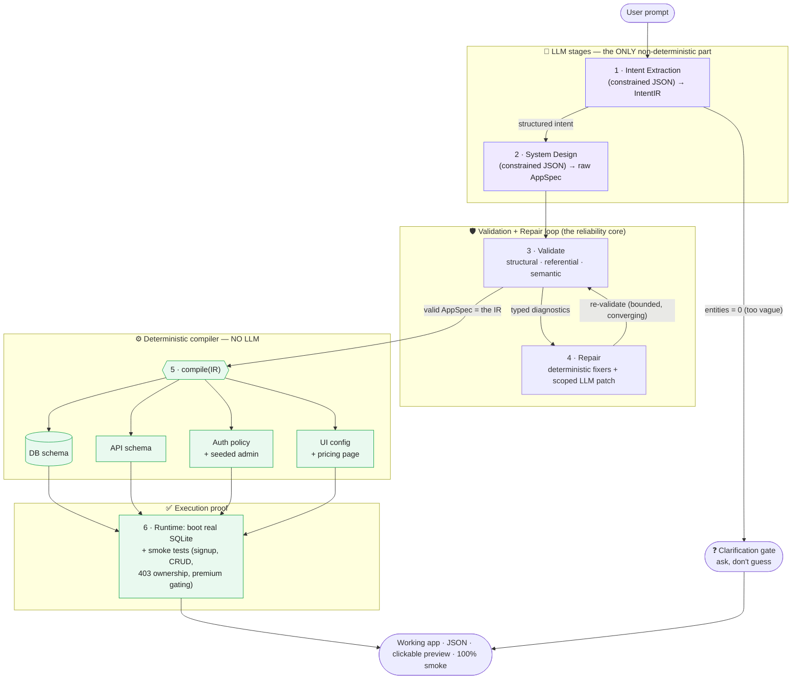
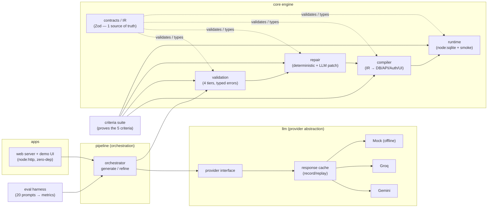
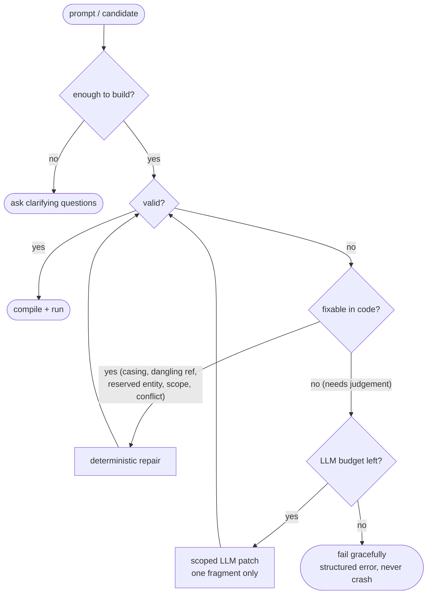

# System Design

## The core idea

> **One canonical Intermediate Representation (IR), compiled into four interlocking layers.**
> The LLM does only the small, fuzzy job — understand the human and produce the IR.
> Everything else is **deterministic code**, so the layers *cannot* drift, and most
> failures are fixed without ever calling the model again.

This is a **compiler**, not a prompt: `Natural language → IR → validate/repair → 4 layers → a running app`.

---

## 1. End-to-end pipeline



**Why this wins:** the LLM's variance is confined to a tiny IR. The four layers are
*derived from the same object by code*, so cross-layer consistency is guaranteed by
construction (proven: 200 compiles → 1 identical hash; 10/10 UI fields trace to real
DB columns; 0 scoped-LLM-patch calls across the 20-prompt eval).

---

## 2. Module / component map



---

## 3. The canonical IR (what flows through the system)

```
AppSpec  (the single source of truth)
├── entities      [{ name, fields[], relations[], ownable }]
├── roles         [{ name, isDefault }]
├── permissions   [{ role, entity, actions[], scope, requiresPlan }]
├── pages         [{ name, route, type, entity, access[], widgets[] }]
├── plans         [{ name, price, interval, features[] }]
├── businessRules [ plan_gate | ownership ]
├── auth          { strategy, requireAuth }
└── assumptions   [ documented guesses for vague prompts ]
```

Everything references everything else **by name** → cross-layer checks become a
symbol-table problem the validator resolves like a linker.

---

## 4. Tech stack & why

| Concern | Choice | Why |
| --- | --- | --- |
| Language | **TypeScript** (strict) | one source → contract + types + JSON-Schema |
| Contract / IR | **Zod** | runtime validation + inferred types + strict (rejects hallucinated keys) |
| LLM | **Gemini** (Groq/Mock pluggable) | free tier; provider abstraction for routing & cost |
| Reliability | retry + rate-limit-hint + model fallback + response cache | survives outages & rate limits |
| Runtime DB | **node:sqlite** (built-in) | zero-dep execution proof, no native build |
| Web | **node:http** (zero-dep) | deploys anywhere (Azure App Service), no framework |
| Determinism | temp 0 · code compilation · normalization · cache | same input → same output |

---

## 5. Failure handling (decision flow)



Reasonable gaps → **documented assumptions**. True vagueness → **clarification**.
Everything else → **typed error → targeted fix → re-validate**, bounded so it always terminates.
